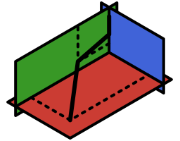

[//]: Logo
<p align="center">
    
</p>

# Projected Gradient Optimization

[//]: Badges
[](https://JuDO-dev.github.io/Progradio.jl/stable)
[](https://JuDO-dev.github.io/Progradio.jl/dev)
[](https://github.com/JuDO-dev/Progradio.jl/actions/workflows/CI.yml?query=branch%3Adev)
[](https://codecov.io/gh/JuDO-dev/Progradio.jl)

## Installation
```julia
using Pkg; Pkg.add("Progradio")
```

## ♾️Unconstrained Problems
$$
\begin{aligned}
\min_x f(x)
\end{aligned}
$$
where $x \in \mathbb{R}^n$, and $f: \mathbb{R}^n \rightarrow \mathbb{R}$ is smooth. Given an initial guess `x_0::Vector` and an in-place gradient function `g!`, it is defined as:
```julia
up = UProblem(x_0, f, g!);
```

## 📦Box-Constrained Problems
$$
\begin{aligned}
\min_x \quad      &f(x)\\
\text{s.t.} \quad &\ell \leq x \leq u,
\end{aligned}
$$
where $\ell, u \in \mathbb{R}^n$, and $f: \mathbb{R}^n \rightarrow \mathbb{R}$ is smooth. Defined as:
```julia
bcp = BCProblem(x_0, ℓ, u, f, g!);
```

## 📐Simplex-Box-Constrained Problems
$$
\begin{aligned}
\min_x \quad        &f(x)\\
\text{s.t.} \quad   &\sum_{j \in \mathcal{S}} x_j = 1, \quad x_j \geq 0 &\forall j \in \mathcal{S},\\
                    &\ell_j \leq x_j \leq u_j &\forall j \notin \mathcal{S},
\end{aligned}
$$
where $\mathcal{S}$ is the set of indices of $x$ in the unit simplex. Given an `S::BitVector`, it is defined as:
```julia
sbcp = SBCProblem(x_0, S, ℓ, u, f, g!);
```

## Available Methods

|Direction\Search       |`Armijo()`[^Bertsekas]|`Wolfe()`|`TrustRegion()`|
|:---------------------:|:--------------------:|:-------:|:-------------:|
|`SteepestDescent()`    | ♾️📦📐        
|`CGFletcherReeves()`   | ♾️📦
|`CGPolakRibiere()`     | ♾️📦
|`CGHagerZhang()`       | ♾️📦
|`LBFGS()`              |
|`Newton()`             |

## Usage
Recommended usage with `solve()`
```julia
# Problem
bcp = BCProblem(x_0, ℓ, u, f, g!);

# Solve
solve(bcp, SteepestDescent(), Armijo())
```
Advanced usage with `Iterator`
```julia
# Iterator
iterator = Iterator(bcp, SteepestDescent(), Armijo());

# Iterate
collect(iterator)
```

[^Bertsekas]: D. P. Bertsekas, "Projected Newton methods for optimization problems with simple constraints", SIAM Journal on Control and Optimization, Vol. 20, pp.221-246, 1982.