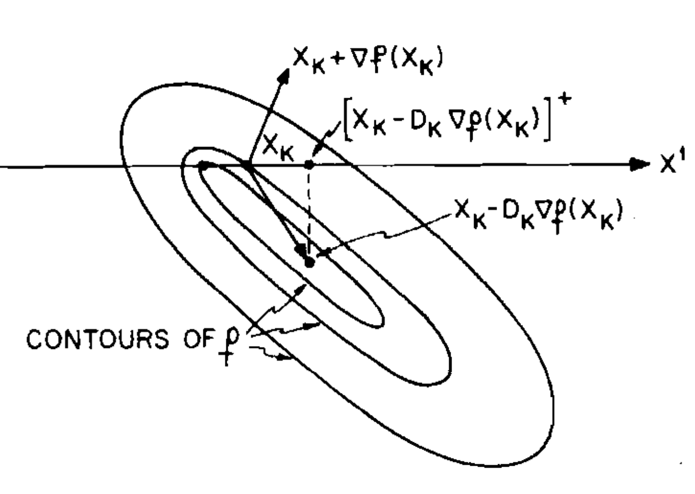

<style>
    :root {font-size: 200%}
    h1 {font-size: 250%}
    h2 {font-size: 150%}
    h6 {font-size: 60%; color: grey; font-weight: normal}
    header {font-size: 80%}
    footer {font-size: 80%}
    pre {font-size: 100%}
</style>

# Progradio.jl


A Julia package for 
**Projected Gradient Optimization**

---

## Box-Constrained Optimization

#### Mathematical formulation

$$\min_x f(x) \quad \text{s.t.} \quad x_{\ell} \leq x \leq x_u$$

with $x \in \mathbb R^n$ and $f: \mathbb R^n \rightarrow \mathbb R$, near $x_0$

<br>

#### Julia implementation

`BCProblem(f, g!, x_ℓ, x_u, x_0)`

---

## Line-Search Algorithms

1. Descent direction | 2. Step-size
--- | ---
 | 

###### [1] D. P. Bertsekas, "Projected Newton methods for optimization problems with simple <br> constraints", SIAM Journal on Control and Optimization, Vol. 20, pp.221-246, 1982.

---

## Infinite-Dimensional Optimization
Solving a **sequence** of finite-dimensional problems


each terminated at an approximate solution,
which *warm-starts* the next problem.

---

## Iterative Requirements

<br>

- User-defined termination criteria;

- Exposed optimization `state`;

- Efficient *warm-starting*.

<br>

Not satisfied by the `solve(problem, algorithm)` inteface.

---

## Using Julia's Iteration Interface

We have
```julia
I = iterator(problem, algorithm);

(f0, state) = Base.iterate(I);
(fx, state) = Base.iterate(I, state);
```

in addition to

```julia
solution = solve(problem, algorithm);
```

---

## Available Algorithms

- Line-search `Armijo(direction)` methods

| Direction | Variants |
| --- | --- |
| Steepest Descent | `SteepestDescent()`
| Conjugate Gradient | `FletcherReeves()` <br> `PolakRibiere()` <br> `HagerZhang()`|
| Quasi-Newton | `LBFGS()` |


---

## Example

```julia
sdi = iterator(bcp, Armijo(SteepestDescent()));
cgi = iterator(bcp, Armijo(FletcherReeves()));

(f0, sd_state) = iterate(sdi);
while !terminate_sd(sd_state)
    (fx, sd_state) = iterate(I_sd, sd_state);
end

next = (fx, convert_state(sd_state, cgi));
while next !== nothing
    next = iterate(cgi, next[2]);
end
```

---

## Example


---

## Roadmap

- Add stronger line-search (Wolfe) and trust-region optimizers;

- Use second derivative information (Newton direction);

- Support nonlinear constraints  (penalty, barrier methods).

<br>

#### Get in touch and contribute!